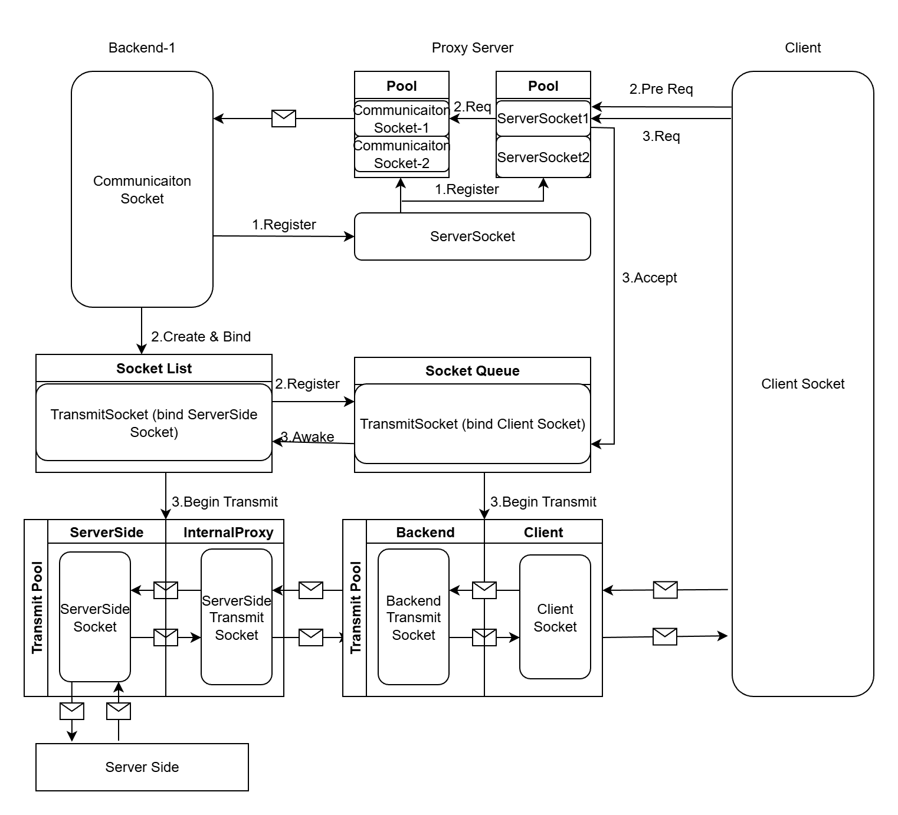

### 前言
    这是一个基于Java的仅支持TCP传输层透传的应用层内网穿透测试版工具。

    目前仅修复了致命bug，未充分测试，架构、周围组件、性能均未充分优化。
    这个工具是我（小白）一时起意，在课余时间构筑的，前后经两次重构。虽然已经重构了几次，但是随着后续测试修改，依然蹩脚，不够优雅。

    这里挖个坑，虽然我几乎从未填过坑，但这次一定。
    预计 3 个月内，我会推出正式版，届时或将提供：足够的稳定性、监控管理组件与界面、更好的拓展性、更强的性能，最重要的努力支持UDP。

    2025/12/16

### 用途
* 个人、小组开发测试，仅支持TCP协议（常用的HTTP、WS经过实测没有问题）
* 游戏联机，如MC（Java版）。经实测，服务器为阿里云最低档ECS（上海区），在江苏的南部偏西使用做内网穿透联机（2名玩家），延迟大部分时间稳定在50ms，部分时间会在50~120ms之间浮动。可能会随着游戏操作波动。

### 优势？
* 部署运行简单，常用的内网穿透工具性能强、功能多、安全性高、稳定，好像是蛮不错的，但是它难安装部署哇...（虽然客户端启动运行是有些麻烦，后期看看能不能搞个小软件或者脚本，整个快捷方式）
* 对学习Java的同学友好，可根据需求自定义修改代码。

### 架构

基础想法很简单，就是让被代理端主动请求服务器，向服务器注册Socket，因为Socket本身是无方向的，利用被代理端主动注册的Socket让服务器向被代理端发送数据即可通过NAT的限制。

由于服务端点（被代理端需要对外提供的服务）的端口已经绑定了ServerSocket，无法主动发起请求，因此只能在被代理端再做一个内部代理，让这个内部代理端主动请求服务器并主动请求服务端点，以搭建服务器与服务端点间的通信管道。

因此，核心有两个透传服务（见图最下侧）：  
(Socket-Socket意为Socket对)

                被代理端点<--->(内部代理)-(服务器)<--->客户端
    (服务端点)Socket-(Socket<--->Socket)-(Socket<--->Socket)-Socket(客户端点)

为了减少Socket的创建与销毁，这里做了池化，在内部代理代理服务器间的Socket对建立后长期使用，无任务时入空闲队列，来任务时唤醒，空闲过久就销毁。

当然被代理端与服务器间的通信(Socket)也必不可少，需要传输标识符、指令等。

### 部署见USE.md

