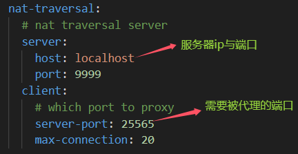
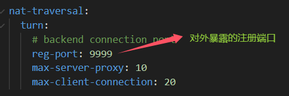
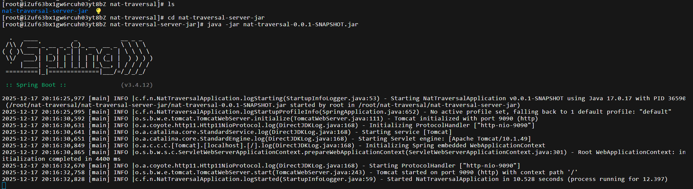
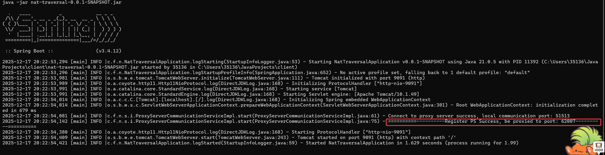
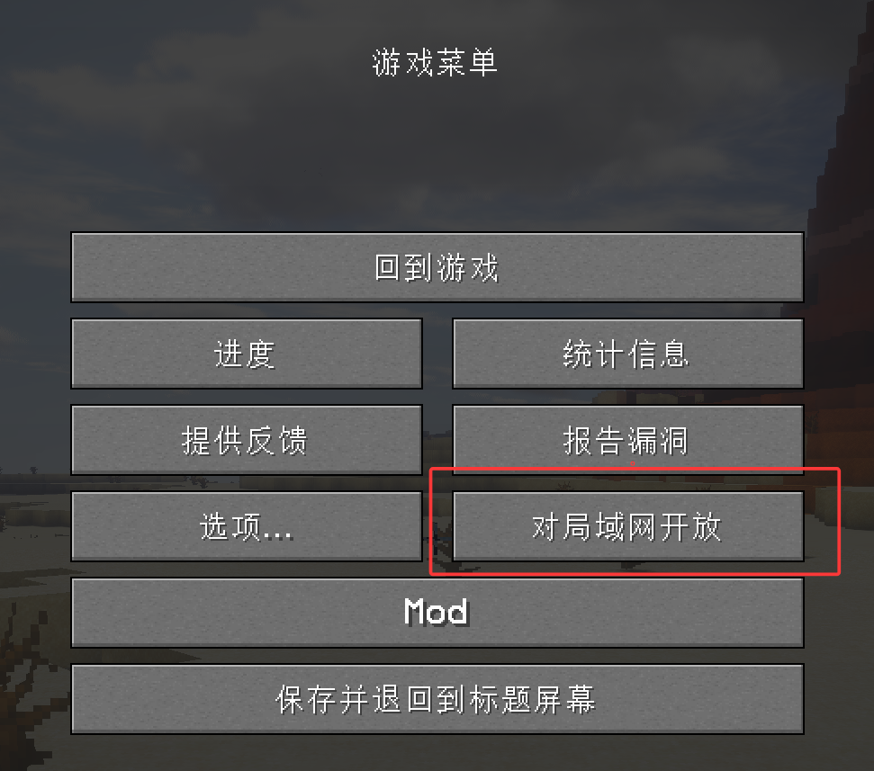
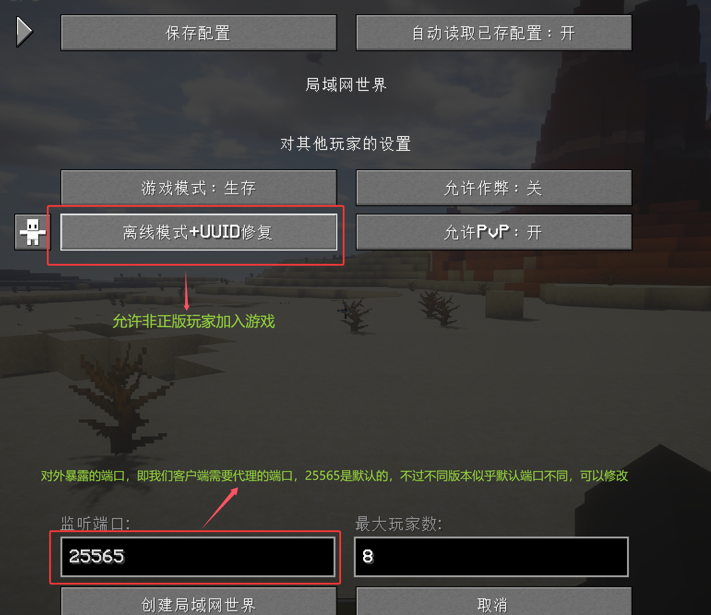
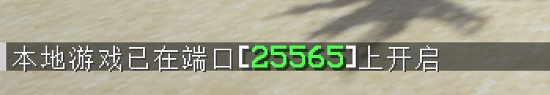
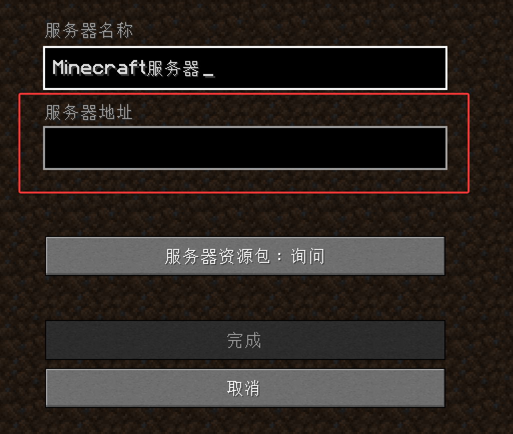

## 快速使用
使用很简单，首先确保你的被代理端（本地）和服务器有Java 17环境，并且服务器安全组除代理服务端口外还需开放49152~65535端口。

进入jar文件夹，将client和server分别复制到本地和服务器，进入按需求修改配置文件后直接在控制台运行jar包即可，日志会生成在logs文件夹下，其中client端被代理端口会打印在日志中，流程如下：

客户端关键配置（记得修改为自己服务器ip与端口和需要被代理的端口）： 



服务端关键配置：



服务器java-jar运行server的jar包： 

```java -jar nat-traversal-0.0.1-SNAPSHOT.jar```



客户端java-jar运行server的jar包：

```java -jar nat-traversal-0.0.1-SNAPSHOT.jar```

 

控制台可看到以下字样

    ==========----------Register PS Success, be proxied to port: 62007----------==========

若有特殊原因无法查看控制台输出，也可在日志中找到。

62007即为服务器代理端口，服务器ip:62007即可访问。

## 我的世界特供
    仅限Java版，因为只有Java版是基于TCP联机的，其余版本基于UDP联机，可以期待下正式版的工具。
这里我用的是1.20.1版本，并安装自定义联机mod： 


我的世界联机时，双方mod要一样（对于大部分mod如此），不然会进不去或者出现别的问题。

首先在服务器启动工具，教程如上。

### 房主
单人游戏，进入地图





点击创建局域网世界： 

 

可在聊天框看到对外的端口，若未加mod不清楚在哪个端口，也可创建联机后在聊天框查看

然后按照上方的步骤在本地启动客户端即可，切记修改需要被代理的端口，此处为25565

### 玩家
多人游戏->添加服务器

 

服务器地址处填 工具运行的服务器ip+服务器代理端口，参照上文此处为62007

    ==========----------Register PS Success, be proxied to port: 62007----------==========

服务器地址示例： 

    111.111.111.111:62007

然后加入游戏即可。

## 关于其他部署方式

Docker: 

这里由于对游戏联机玩家不友好，需要搞Docker，就没测，或者说，单纯懒。
有需要自己写Dockerfile，不过记得运行镜像时，除代理服务端口外还需映射49152~65535端口。


